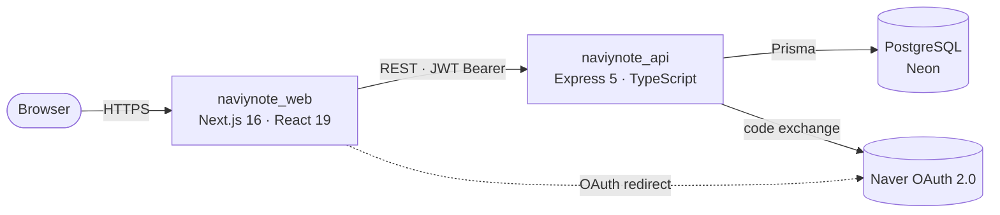

# NaviyNote Web

<details>
<summary>🇰🇷 한국어로 보기</summary>

<br />

> **NaviyNote**의 프론트엔드 클라이언트 — 네이버 OAuth 기반 메모 & 할일 관리 서비스
> **Next.js 16 · React 19 · TypeScript · Tailwind CSS v4**

🚧 **현재 상태:** 초기 개발 단계. 네이버 로그인 및 Todo 목록 조회 기능이 백엔드 API와 연동되어 있습니다. 나머지 화면은 기존 모놀리스 앱에서 마이그레이션을 완료하였으며, 순차적으로 API 연동을 진행 중입니다.

## 소개

**NaviyNote**는 네이버 OAuth 로그인을 기반으로 메모와 할 일을 1:1로 연결하고, 드래그 앤 드롭 및 통합 캘린더 뷰를 통해 효과적으로 일정을 관리할 수 있는 서비스입니다.

초기에는 하나의 Next.js 풀스택(Monolith) 앱으로 개발되었습니다. 이후 모던 클라이언트-서버 아키텍처로의 전환을 학습하기 위해, 기존 모놀리스 프로젝트를 프론트엔드 클라이언트와 전용 API 서버 두 개의 저장소로 분리하는 리팩토링을 진행하고 있습니다.

이 저장소는 그중 **프론트엔드**입니다: 기존 모놀리스의 UI를 이관하고, 기존 Supabase 직접 호출 방식이었던 데이터 레이어를 `naviynote_api`와 통신하는 REST API 클라이언트 구조로 재설계하고 있습니다.

## 관련 저장소

| | 저장소 | 설명 |
|---|---|---|
| 🖥️ | [NaviyNote_web](https://github.com/SJ-1220/NaviyNote_web) | 프론트엔드 클라이언트 — **현재 저장소** |
| ⚙️ | [NaviyNote_api](https://github.com/SJ-1220/NaviyNote_api) | 백엔드 API (Express) |
| 📦 | [NaviyNote](https://github.com/SJ-1220/NaviyNote) | 분리 이전의 원본 풀스택 모놀리스 |

## 프로젝트 목적

새로운 제품을 만드는 것이 아닌, **아키텍처 개선을 목적으로 한 리팩토링 프로젝트**입니다. 이미 완성되어 동작하는 모놀리스 앱을 분리(Decoupling)된 시스템으로 재구축합니다. 

프론트엔드 관점에서는 서버에 강하게 결합되어 있던 데이터 접근 로직과 `next-auth` 세션을 명시적인 API 클라이언트 및 토큰 기반 인증 컨텍스트(Auth Context)로 교체함으로써, 클라이언트와 서버 간의 경계(Network Boundary)를 명확히 분리하는 것을 목표로 합니다.

## 기술 스택

| 영역 | 스택 |
|---|---|
| 프레임워크 | Next.js 16 (App Router) · React 19 · React Compiler |
| 언어 | TypeScript |
| 스타일링 | Tailwind CSS v4 |
| 상태 관리 | Zustand |
| 인증 | 커스텀 `AuthContext` (메모리 내 JWT 저장 + Refresh Token 쿠키, `authFetch` 래퍼) |
| 캘린더 / 차트 | FullCalendar 6 · Chart.js 4 |
| DnD / 토스트 | react-dnd (HTML5 backend) · sonner |
| 애널리틱스 | Google Analytics 4 (선택 사항) |
| 제거 예정 | `next-auth` (기존 세션 인증 잔재, 완전 제거 진행 중) |

## 기능

### 제품 기능 (전체 시스템 관점)

- [x] 네이버 OAuth 2.0 로그인 / 로그아웃
- [x] JWT 액세스 + 리프레시 토큰, 자동 재발급
- [ ] Todo CRUD
  - [x] 목록 조회 연동
  - [ ] 생성 / 수정 / 삭제 / 필터 조회 연동
- [ ] 메모 CRUD
- [ ] 메모 4구역 자동 분류 + 드래그앤드롭 상태 변경
- [ ] 메모 ↔ Todo 1:1 연결
- [ ] 캘린더 뷰 + 날짜가 지정되지 않은 Todo를 드래그하여 일정 등록
- [ ] 메인 대시보드 (최근 메모 / ±5일 Todo / 중요 Todo)
- [ ] 통계
- [ ] 친구 기능
- [ ] 네이버 캘린더 일정 등록 연동

### 이 저장소 (프론트엔드 구현)

- [x] Next.js 16 App Router + React 19 + Tailwind CSS v4 환경
- [x] 기존 모놀리스 앱의 페이지 / 컴포넌트 / 훅 / 스토어 마이그레이션
- [x] 커스텀 `AuthContext` 인증 (next-auth 제거 진행 중)
- [x] 네이버 로그인 플로우 + `/naver/callback`
- [x] `authFetch` (401 → refresh → 재시도)
- [x] Todo 타입 및 응답 스키마를 API 계약(Contract)에 맞게 정렬
- [x] `GET /api/todo` 목록 조회 연동
- [ ] Todo 생성 / 수정 / 삭제 / 필터 조회 API 연동
- [ ] 메모 API 연동 (백엔드 대기)
- [ ] 대시보드 / 통계 데이터 연동
- [ ] 드래그앤드롭 동작 재검증
- [ ] `next-auth` 의존성 완전 제거
- [ ] Vercel 배포

## 아키텍처


## 프로젝트 구조

```
src/
├─ app/
│  ├─ layout.tsx · globals.css · error.tsx · not-found.tsx
│  └─ (pages)/
│     ├─ (landing)/          # 랜딩 페이지 + 네이버 로그인
│     ├─ main/               # 대시보드 (인증 가드)
│     ├─ todo/               # 할일 목록 + 캘린더, 인터셉트 상세 모달
│     ├─ memo/               # 메모 보드, 인터셉트 상세 모달
│     ├─ stats/              # 통계 (Chart.js)
│     ├─ friend/             # 친구 (UI 준비 중)
│     └─ naver/callback/     # OAuth code → API로 POST → 토큰 저장
├─ components/               # Header, Main/*, Memo/*, ToDo/*
├─ context/
│  └─ AuthContext.tsx        # JWT 상태 관리, 토큰 재발급, authFetch
├─ hooks/                    # useToDos, useMemos, useCalendar, ...
├─ lib/
│  └─ api/                   # todoApi (연동됨) · memoApi / mainApi (백엔드 대기)
├─ store/                    # zustand: todoStore, memoStore
└─ types/                    # todo, memo
```

## 로컬 개발

### 사전 준비

- Node.js 24+
- [`naviynote_api`](https://github.com/SJ-1220/NaviyNote_api) 실행 및 접근 가능 상태

### 환경 변수

`.env.local.example`을 `.env.local`로 복사합니다.

| 변수명 | 필수 여부 | 예시 | 설명 |
| --- | --- | --- | --- |
| `NEXT_PUBLIC_API_URL` | 필수 | `http://localhost:8080` | `naviynote_api` 백엔드 Base URL. `src/lib/api/*` 내 모든 요청에서 사용합니다. |
| `NEXT_PUBLIC_GOOGLE_ANALYTICS` | 선택 | `G-XXXXXXXXXX` | GA4 측정 ID. 비워둘 경우 비활성화됩니다. |
| `NEXTAUTH_URL` | 레거시 | `http://localhost:3000` | 기존 next-auth 설정의 잔재 — 더 이상 사용되지 않습니다. |
| `NEXTAUTH_SECRET` | 레거시 | — | 기존 next-auth 설정의 잔재 — 더 이상 사용되지 않습니다. |
| `NAVER_CLIENT_ID` | 레거시 | — | 기존 next-auth의 서버 사이드 네이버 프로바이더용 설정 — OAuth 처리는 이제 `naviynote_api`에서 담당합니다. |
| `NAVER_CLIENT_SECRET` | 레거시 | — | 위와 동일 |

### 실행

```bash
npm install
cp .env.local.example .env.local     # 최소한 NEXT_PUBLIC_API_URL 설정
npm run dev                          # http://localhost:3000
```

## 모놀리스 앱 대비 변경점

| 항목 | NaviyNote (기존 모놀리스) | naviynote_web (현재 클라이언트) |
| --- | --- | --- |
| 데이터 접근 | `src/services/*` 내 Supabase 클라이언트 직접 호출 | `src/lib/api/*` 내 `fetch` 기반 REST API 클라이언트 호출 |
| 인증 방식 | `next-auth` 세션 기반 (`/api/auth/[...nextauth]`) | 커스텀 `AuthContext` (메모리 Access Token + Refresh Token 쿠키, `authFetch` 재시도 래퍼) |
| OAuth 처리 | 동일 앱 내부의 서버 사이드에서 처리 | `naviynote_api`로 위임 (클라이언트는 `code` / `state` 전달만 담당) |
| 백엔드 | 동일 저장소 내 Next.js API Routes | `NEXT_PUBLIC_API_URL`을 통해 통신하는 별도 백엔드 서비스 |
| 타입 정의 | Supabase DB 테이블 형태 (`user_email`, `memo_id`) | REST API 및 Prisma 모델 형태에 정렬 (`userId`, `memoId`, `createdAt`) |

</details>

---

> Decoupled frontend for **NaviyNote** — a Naver-OAuth memo & todo manager.
> **Next.js 16 · React 19 · TypeScript · Tailwind CSS v4**

🚧 **Status:** Early development. Naver login and the Todo list view are wired to the backend. The remaining screens are ported from the monolith and their API wiring is in progress.


## About

**NaviyNote** is a memo & schedule manager built around Naver OAuth login, letting users
link todos and memos 1:1 and manage them through drag-and-drop and a unified calendar view.

It was originally shipped as a single Next.js full-stack app. To practice modern
client–server architecture, that monolith is being split into two repositories — this
frontend client and a dedicated API server.

This repository is the **frontend**: the UI is carried over from the monolith, while the
data layer is being rewired from direct Supabase calls to a REST client that talks to
`naviynote_api`.

## Related repositories

| | Repository | Description |
|---|---|---|
| 🖥️ | [NaviyNote_web](https://github.com/SJ-1220/NaviyNote_web) | Frontend client — **this repo** |
| ⚙️ | [NaviyNote_api](https://github.com/SJ-1220/NaviyNote_api) | Backend API (Express) |
| 📦 | [NaviyNote](https://github.com/SJ-1220/NaviyNote) | Original full-stack monolith this project decouples |

## Why this project

The goal is not a new product but a deliberate re-architecture exercise: take a finished,
working monolith and rebuild it as a decoupled system. On the frontend that means
replacing server-coupled data access and next-auth sessions with an explicit API client
and a token-based auth context — seeing clearly where the network boundary is.

## Tech Stack

| Area | Stack |
|---|---|
| Framework | Next.js 16 (App Router) · React 19 · React Compiler |
| Language | TypeScript |
| Styling | Tailwind CSS v4 |
| State | Zustand |
| Auth | Custom `AuthContext` — in-memory JWT + refresh cookie, `authFetch` wrapper |
| Calendar / Charts | FullCalendar 6 · Chart.js 4 |
| DnD / Toast | react-dnd (HTML5 backend) · sonner |
| Analytics | Google Analytics 4 (optional) |
| Pending cleanup | `next-auth` — left over from the old session auth, to be removed |

## Features

### Product features (whole system)

- [x] Naver OAuth 2.0 login / logout
- [x] JWT access + refresh tokens with automatic re-issue
- [ ] Todo CRUD
  - [x] List view wired to the API
  - [ ] Create / update / delete / filtered queries wired
- [ ] Memo CRUD
- [ ] Memo auto-sorting into 4 quadrants + drag-and-drop state changes
- [ ] Memo ↔ Todo 1:1 linking
- [ ] Calendar view + drag a date-less todo onto a day to schedule it
- [ ] Main dashboard (recent memos / ±5-day todos / important todos)
- [ ] Statistics
- [ ] Friends
- [ ] Naver Calendar schedule registration

### This repository (frontend)

- [x] Next.js 16 App Router + React 19 + Tailwind v4 setup
- [x] Pages / components / hooks / stores ported from the monolith
- [x] Custom `AuthContext` auth (next-auth removal in progress)
- [x] Naver login flow + `/naver/callback`
- [x] `authFetch` (401 → refresh → retry)
- [x] Todo types / response shape aligned to the API contract
- [x] `GET /api/todo` list query wired
- [ ] Todo create / update / delete / filtered queries wired
- [ ] Memo API wired (waiting on backend)
- [ ] Dashboard / statistics data wired
- [ ] Drag-and-drop behavior re-verified
- [ ] `next-auth` dependency fully removed
- [ ] Deployed to Vercel

## Architecture



## Project Structure

```
src/
├─ app/
│  ├─ layout.tsx · globals.css · error.tsx · not-found.tsx
│  └─ (pages)/
│     ├─ (landing)/          # marketing landing + Naver sign-in
│     ├─ main/               # dashboard (auth-guarded)
│     ├─ todo/               # todo list + calendar, intercepted detail modal
│     ├─ memo/               # memo board, intercepted detail modal
│     ├─ stats/              # statistics (Chart.js)
│     ├─ friend/             # friends (placeholder)
│     └─ naver/callback/     # OAuth code → POST to API → store token
├─ components/               # Header, Main/*, Memo/*, ToDo/*
├─ context/
│  └─ AuthContext.tsx        # JWT state, refresh, authFetch
├─ hooks/                    # useToDos, useMemos, useCalendar, ...
├─ lib/
│  └─ api/                   # todoApi (wired) · memoApi / mainApi (awaiting backend)
├─ store/                    # zustand: todoStore, memoStore
└─ types/                    # todo, memo
```

## Local Development

### Prerequisites

- Node.js 24+
- [`naviynote_api`](https://github.com/SJ-1220/NaviyNote_api) running and reachable

### Environment variables

Copy `.env.local.example` to `.env.local`.

| Variable | Required | Example | Description |
|---|:---:|---|---|
| `NEXT_PUBLIC_API_URL` | **yes** | `http://localhost:8080` | Base URL of `naviynote_api`. Every `src/lib/api/*` call uses it. No trailing slash. |
| `NEXT_PUBLIC_GOOGLE_ANALYTICS` | no | `G-XXXXXXXXXX` | GA4 Measurement ID. Leave blank to disable. |
| `NEXTAUTH_URL` | legacy | `http://localhost:3000` | From the removed next-auth setup — no longer used. |
| `NEXTAUTH_SECRET` | legacy | — | From the removed next-auth setup — no longer used. |
| `NAVER_CLIENT_ID` | legacy | — | Was used by next-auth's server-side Naver provider; OAuth is now handled by `naviynote_api`. |
| `NAVER_CLIENT_SECRET` | legacy | — | Same as above. |

### Run

```bash
npm install
cp .env.local.example .env.local     # set NEXT_PUBLIC_API_URL at minimum
npm run dev                          # http://localhost:3000
```

## Differences from the monolith

| Concern | NaviyNote (monolith) | naviynote_web |
|---|---|---|
| Data access | Supabase client in `src/services/*` | `fetch`-based clients in `src/lib/api/*` hitting a REST API |
| Auth | next-auth session (`/api/auth/[...nextauth]`) | Custom `AuthContext`: in-memory access token + refresh cookie, `authFetch` retry wrapper |
| OAuth handling | Server-side inside the same app | Delegated to `naviynote_api`; the client only relays `code` / `state` |
| Backend | Next.js API routes in the same repo | Separate service via `NEXT_PUBLIC_API_URL` |
| Types | Supabase row shapes (`user_email`, `memo_id`) | Aligned to the API / Prisma shapes (`userId`, `memoId`, `createdAt`) |
